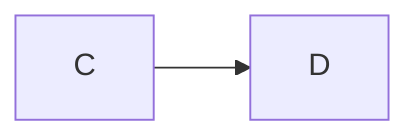

###责任链模式
将请求的发送和接收解耦，让多个接收对象都有机会处理这个请求，将这些接收对象串成一条链，并沿着这个链传递
这个请求，直到链上的某个对象能够处理它为止。    
在责任链模式中多个处理器（也就是刚刚定义中说的“接收对象”）依次处理同一个请求，一个请求先经过A处理器处理，
然后再把请求传递给B处理器，B处理器处理完再传给C处理器，以此类推，形成一个链条，链条上的每个处理器各自承担
各自的处理职责，因此叫做责任链模式。
- 链上的每个对象都有机会处理请求。
- 链上的每个对象都持有下一个对象的引用。
- 链上的某个对象无法处理当前请求，它会把相同的请求传递给下一个对象。

